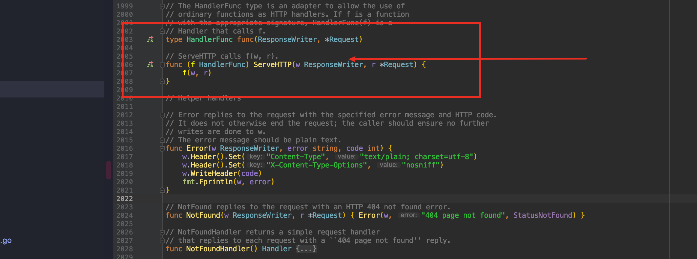
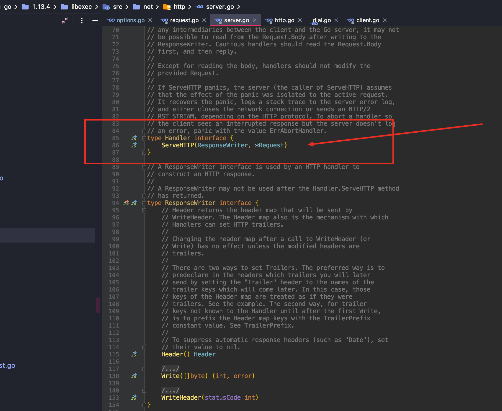
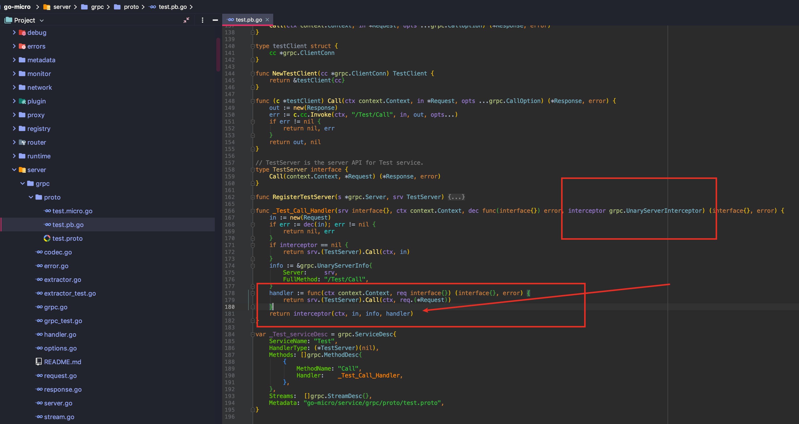
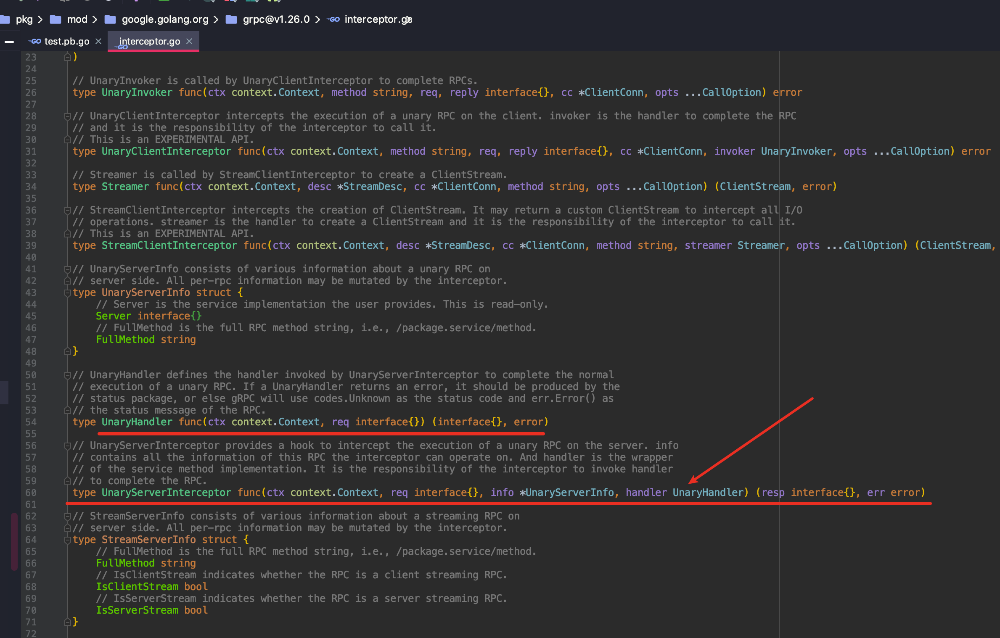
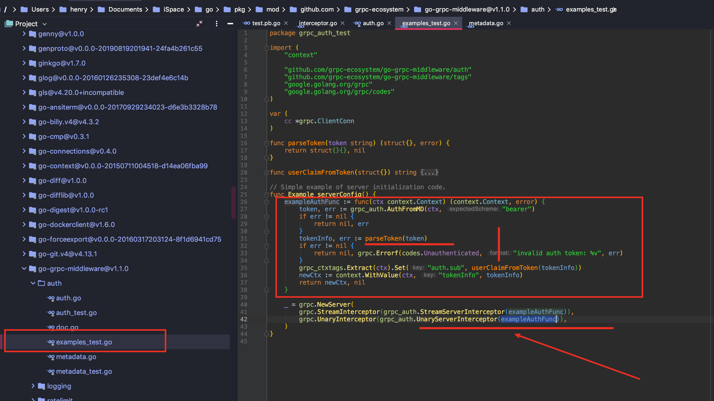

## Protobuf 安装 

安装protobuf 

> #下载 protoBuf：
>
> git clone https://github.com/protocolbuffers/protobuf.git
>
> #安装依赖库
>
> sudo apt-get install autoconf		automake 	libtool 	curl	make	g++	unzip libffi-dev -y
>
> #安装
>
> cd protobuf/ 
>
> ./autogen.sh 
>
> ./configure 
>
> make 
>
> sudo make install 
>
>  sudo ldconfig # 刷新共享库 很重要的一步啊 
>
> #安装的时候会比较卡
>
>  #成功后需要使用命令测试
>
> protoc –h

获取proto包

> #Go语言的proto API接口
>
> go get -v -u github.com/golang/protobuf/proto

安装protoc-gen-go插件

它是一个 go程序，编译它之后将可执行文件复制到\bin目录。

> #安装
>
> go get -v -u github.com/golang/protobuf/protoc-gen-go
>
> #编译
>
> cd $GOPATH/src/github.com/golang/protobuf/protoc-gen-go/
>
> go build
>
> #将生成的 protoc-gen-go可执行文件，放在/bin目录下
>
> sudo cp protoc-gen-go /bin/


对于rpc服务需要用protoc编译器生成相应语言的代码

> protoc --proto_path=IMPORT_PATH --cpp_out=DST_DIR  --python_out=DST_DIR --go_out=DST_DIR    path/to/file.proto

IMPORT_PATH声明了一个.proto文件所在的解析import具体目录。


## grpc


## consul

下载安装

>#这里以 Linux系统为例：
>
>wget https://releases.hashicorp.com/consul/1.2.0/consul_1.2.0_linux_amd64.zip
>
>unzip consul_1.2.0_linux_amd64.zip
>
>mv consul /usr/local/bin/

其它系统版本可在这里下载： https://www.consul.io/downloads.html


## micro

>
>
>go get -u -v github.com/go-log/log
>
>go get -u -v github.com/gorilla/handlers
>
>go get -u -v github.com/gorilla/mux
>
>go get -u -v github.com/gorilla/websocket
>
>go get -u -v github.com/mitchellh/hashstructure
>
>go get -u -v github.com/nlopes/slack
>
>go get -u -v github.com/pborman/uuid
>
>go get -u -v github.com/pkg/errors
>
>go get -u -v github.com/serenize/snaker
>
>go get github.com/micro/micro

编译安装micro

```shell
cd $GOPATH/src/github.com/micro/micro
go build -o micro main.go
sudo cp micro /bin/
```

插件安装

```shell
go get -u github.com/golang/protobuf/{proto,protoc-gen-go}
go get -u github.com/micro/protoc-gen-micro
```


> Protoc --proto_path=.   	--go_out=.	--micro_out=.		proto/example/example.proto
>
> 
>
> micro new --type "srv" micro/rpc/srv
>
> micro new --type "web" micro/rpc/web
>
> #"srv" 是表示当前创建的微服务类型 
>
> #sss是相对于go/src下的文件夹名称 可以根据项目进行设置 
>
> #srv是当前创建的微服务的文件名
>
> 


## go-micro 剖析点


>  go语言是可以自定义类型的
>
>  type Option func(*Options)  这是一个函数类型

这是类似 HTTP request 的设计, 在参数中, 用指针返回... 而不是 通过 返回值返回.

很多设计, 都是相同的... 你去看标准库, http 的 request / response 设计,  如果好奇, 如果 返回值, 不在  参数里, 通过返回值, 返回, 能不能做? 是不是很难?  想明白之后, 就能借鉴这个技巧... 因为不这样设计, 几乎没有更好的办法.

go-micro 这个用法, 非常高阶... 组合了几个复杂用法, 如果不用他这个写法, 解决他要解决的问题, 会比较难写... 会写出非常丑陋且不好维护的代码.

为啥 go-micro 的作者是大佬, 这就是大佬... 这个技巧, 虽然看懂还算容易, 要学会应用, 就更难了.


/usr/local/Cellar/go/1.13.4/libexec/src/net/http/server.go

标准库:




type HandlerFunc func(ResponseWriter, *Request)



```go
type Handler interface {
 ServeHTTP(ResponseWriter, *Request)
}
```

这是所有 go web 框架, 都要实现的接口

micro , gin, beego, 等,

标准库的风格, 首个参数, 是返回值.


标准库, http 的 request / response 设计, 如果 返回值不在 参数里, 通过返回值, 返回, 能不能做? 是不是很难? --------指针地址形式



刚刚发的这个 grpc 的 生成代码, 可以看一下 interceptor grpc.UnaryServerInterceptor 这个拦截器的实现机制.

这里handler 是个闭包函数.  几乎是非常典型的用例.

go-micro 借鉴了不少 grpc 的设计思想




grpc 这个拦截器, 算是很高阶的用法. 你面试, 跟人讲, 我用过 grpc 的拦截器, 对路由做了鉴权, 支持 auth, api_key, ssl , 还有 acl 规则, 面试官会很感兴趣的

看到不懂的代码, 不要放过去. 有好奇心, 也要花时间琢磨.

查源码, 看注释, 查用例, github 全网搜代码, 看哪些中间件在用. 为啥要用, 这么奇怪的写法, 为了解决什么问题, 你找到用例, 就能猜对方的需求, 然后逐步还原

搜 grpc Interceptor

不然你找不到啥有价值的信息.

proto 生成的代码, 要多看, 刚刚那个micro 示例, 生成的代码很少, 但是你要每行都搞明白, 就很厉害了.

这个 Interceptor 是每个 grpc 都会调用的, 这里留了个口子, 方便你对 每个 grpc 调用, 干一些坏事, 或者好事

想想你可以对每次请求, 都可以干事情, 是不是可以为所欲为了


[github.com/grpc-ecosystem/go-grpc-middleware@v1.1.0/auth/auth.go](http://github.com/grpc-ecosystem/go-grpc-middleware@v1.1.0/auth/auth.go)


这是 grpc 官方的一个 auth 中间件, 就是利用了这个拦截器实现


[https://github.com/grpc-ecosystem/go-grpc-middleware](https://github.com/grpc-ecosystem/go-grpc-middleware)

这些项目, 才需要好好看. 很多垃圾 project, 没必要看, 都是 demo. 真正有价值的, 都是基础库




官方特别好心,怕 给你了 auth 接口, 你也不会写. 连使用示例, 都给你写好


3年和5年, 是个分水岭.

多看书, 多看源码, 多写项目. 其他都是扯蛋.

3年掌握大部分工作技能. 5年, 有能力带别人做事. 想清楚以后的规划. 

如果5年都还没想明白, 可能就稀里糊涂写代码, 混着. 不会太好, 不会太差.

时间过的很快. 早几年多付出些. 工作5年之后, 结了婚, 你业余学习的时间, 会越来越少.

语言上, 吃透 go, 就够了. go 深度足够广, 跟 java 一样. 可以吃很深. 以后用 go 的公司, 会越来越多. 掌握越好, 越能吃红利.

其他, 后端解决的问题: 主要是 分布式, 高并发, 高可用, 一致性, kv, 数据库, 消息队列, 大数据平台 等这些中间件的 使用/调优经验.

分布式的东西, 100-200技术团队规模的公司, 应该就会遇到. k8s, 微服务, grpc, 用起来, 自然就分布式的. go-micro 解决的问题, 就是上诉列的细节点.


